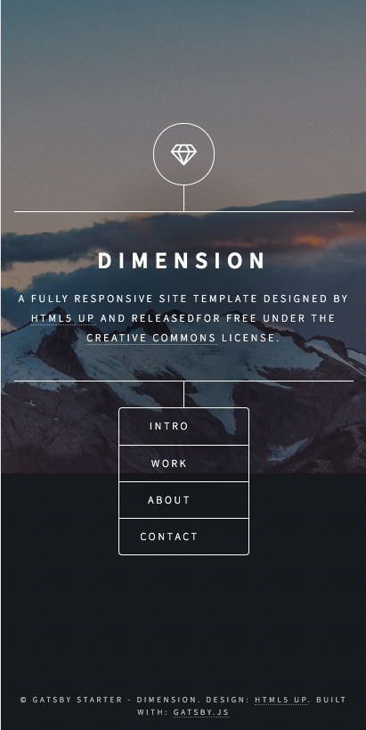

# 记录搭建个人博客时用到的技术

不实用 hexo or hugo，完全自己搭建。为了避免自己网站挂，还可以备用，打算从 hexo 迁移到 gatsby（这个用 gateby 搭建的网站很不错：https://www.paulcliftonphotography.com/editorial-photography）。

## 1. 云服务器

目前是腾讯云。

## 2. 前端框架

目前是 react

## 3. nginx

nginx 实现转发。查看 nginx 配置是否 ok，及查看 nginx 配置。

```bash
nginx -t
```

## 4. 配置 https

查看 [开启 https](https://github.com/xiaogliu/step-by-step/blob/master/09_Utilties/9_nginx/04.%E5%BC%80%E5%90%AF%20https.md)

## 5. 更新

目前使用的是 [cyberduck](https://cyberduck.io/)，后续考虑加入 CICD

## 6. design 

- home1:
 
 
